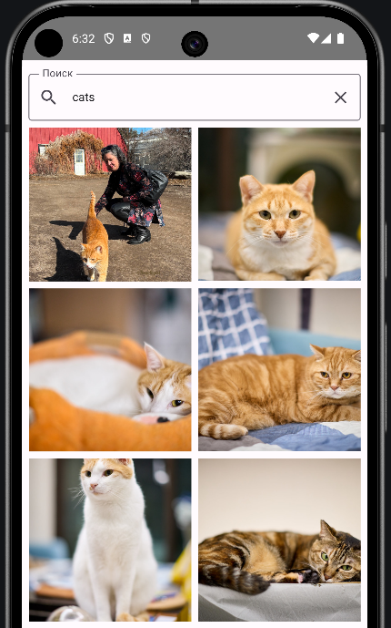
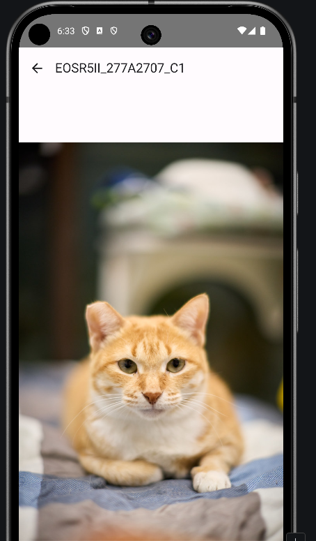

# Flickr Gallery App

Приложение для просмотра фотографий из Flickr API, написанное на Jetpack Compose для тестового задания.

## Функционал
- Грид с квадратными фотографиями.
- Экран детального просмотра с pinch-to-zoom.

## Скриншоты
| Грид | Детали |
|------|--------|
|  |  |

## Установка
1. Клонируйте репозиторий.
2. Добавьте Flickr API-ключ в `FlickrApi.kt`.
3. Соберите в Android Studio.
